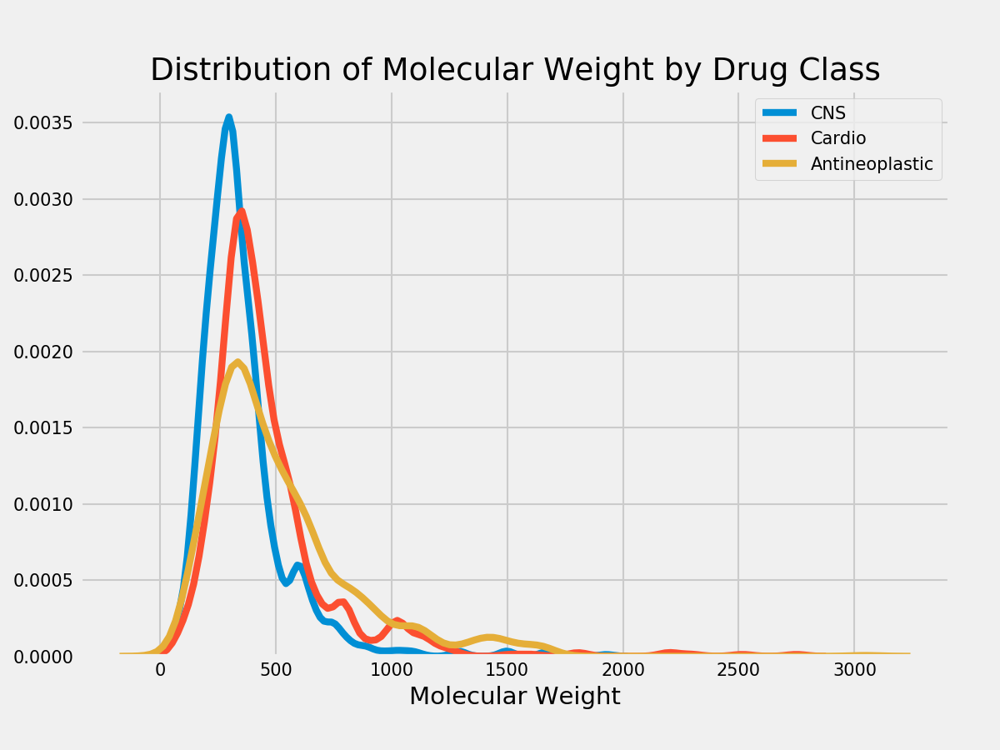
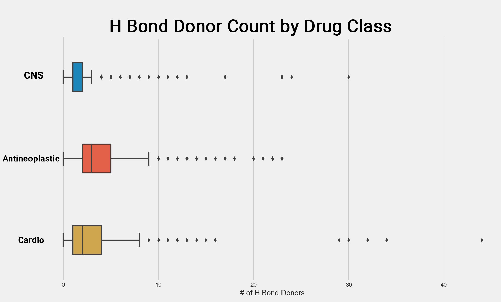
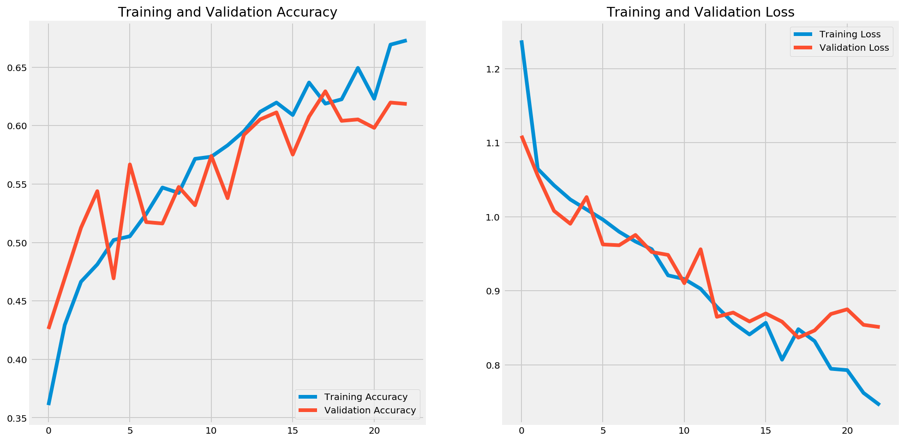
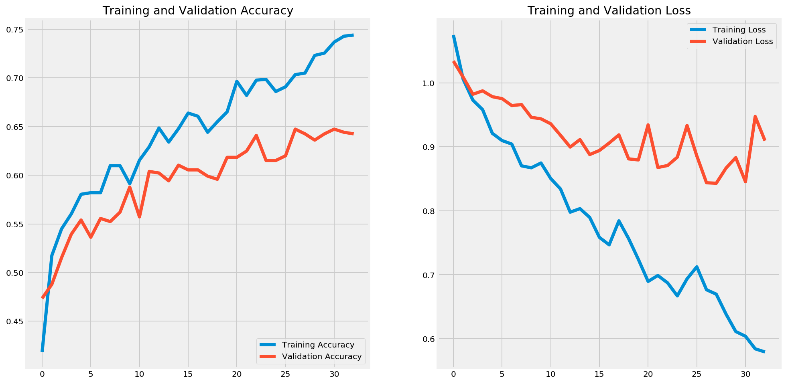
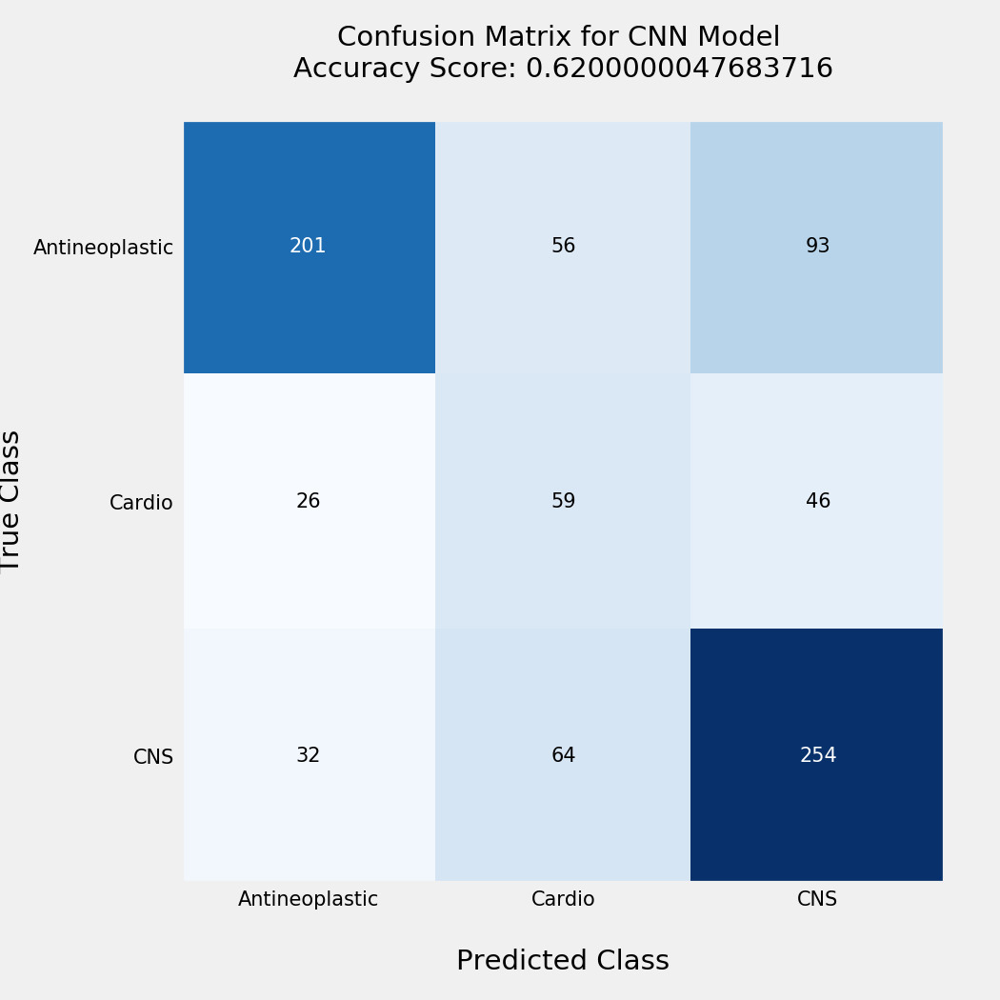
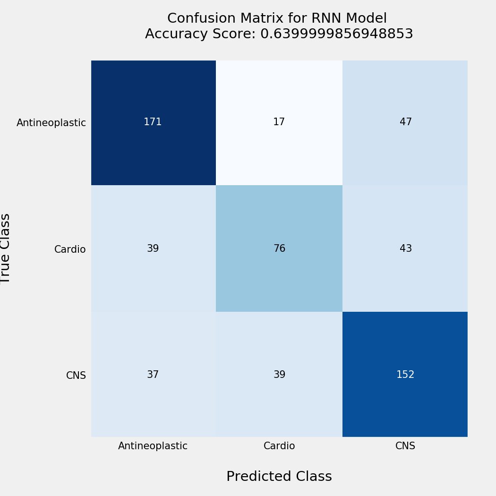
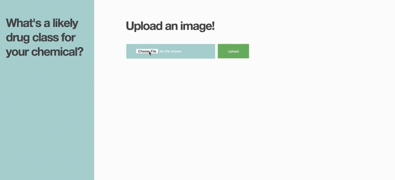

# Molecular Cell Classification
*Acknowledgments: This project is inspired by the work done in the article, [Learning Drug Functions from Chemical Structures with Convolutional Neural Networks and Random Forests](https://pubs.acs.org/doi/10.1021/acs.jcim.9b00236) by Jesse G Meyer, Shengchao Liu, Ian J Miller, Joshua J Coon, Anthony Gitter Journal of Chemical Information and Modeling. 2019, 59(10) 4438-4449. Their github and data sources can be found [here.](https://github.com/jgmeyerucsd/drug-class)*

## Executive Summary
Using two types of molecular structure representation of chemicals: 2D molecular structure (image data) and SMILES (text strings), I compare the performance of a Convolutional Neural Network (CNN) and a Recurrent Neural Network (RNN) on classifying the chemicals by their MeSH therapeutic drug class.

---

## Problem Statement
Neglected diseases is a term used to describe diseases that affect a niche population with little to no treatments available. The current drug research & development (R&D) system is long and costly, which does not incentivize finding new drug treatments for neglected diseases.

There are examples of drug treatments that were originally developed to treat cancer which were later "shelved," or not used, when proven to be ineffective for treating cancer. Some years later, researchers will come across this drug treatment and discover that it's actually effective in treating another disease, like a neglected disease.

With the onset of image processing techniques, I wanted to explore the possibility of predicting promising new drug treatments based on their molecular structures.

---

## What's my MVP here?

Given the data provided by Meyer, et. al, I want to explore classifying molecules based on:

1. Chemical molecular structure (provided as images). Ex:

2. SMILES (provided as text strings). Ex:
##    Brc1c(NC2=NCCN2)ccc2nccnc12

I want to compare which model is more accurate at predicting the drug therapy class. If molecular structures perform better, then that implies there is information about the geometric structure of chemicals that is more representative of its properties.

---
## Data

For now, I have copied a subset of the data provided by Meyer, et. al to perform a binary (antineoplastic, or cns) classification model [here](./data/CID_properties_nr.csv).

Here are the available chemicals from the original dataset:

|Drug Class|Number of Chemicals|
|:---|:---|
|antineoplastic|1174|
|cns|1141|
|cardio|787|
|antiinflammatory|372|
|hematologic|268|
|gastrointestinal|255|
|lipidregulating|164|
|reproductivecontrol|148|
|antiinfective|140|
|dermatologic|108|
|respiratorysystem|100|
|urological|22|

In order to have relatively balanced classes, I am focusing the classification model on the three biggest classes: Antineoplastic, CNS, and Cardio.

The images are split into my train set [here](./train_data) and test set [here](./test_data).

---

## EDA

Exploring some of the physical differences among the classes.

#### Molecular Weights

From this distribution, we can see that the molecular weights are distinct for each class. CNS molecules, in general, have a higher molecular weight than the other classes.

#### Hydrogen Bonds
Hydrogen bonds are a special type of attraction where one hydrogen atom bonds to a very electronegative atom in vicinity of another electronegative atom with a lone pair of electrons [(source).](https://chem.libretexts.org/Bookshelves/Physical_and_Theoretical_Chemistry_Textbook_Maps/Supplemental_Modules_\(Physical_and_Theoretical_Chemistry\)/Physical_Properties_of_Matter/Atomic_and_Molecular_Properties/Intermolecular_Forces/Specific_Interactions/Hydrogen_Bonding)

__Hydrogen bond acceptors__ are typically electronegative atoms that have a lone pair of electrons.

__Hydrogen bond donors__ are hydrogens that are attached to one of those electronegative elements(like Oxygen or Nitrogen). The positive charge that this hydrogen acquires allows it to bond to the nearby electronegative atom.

From these boxplot charts, we see the Antineoplastic drugs have generally more H bond acceptors and H bond donors per molecule. The distribution ranges for each class.

---

## Modeling
__Baseline:__
If I were to randomly assign a drug class to each of my chemicals, my baseline accuracy would be:
- 0.37 for Antineoplastic drug class
- 0.37 for CNS drug class
- 0.25 for Cardio drug class

|Model|Data Type|Accuracy Score|
|:---|:---|:---|
|SVC|Chemical properties (numeric)|0.53|
|CNN|2D Chemical structures (images)|0.61|
|RNN|1D Chemical structures (strings)|0.66|

__[SVC Model](./code/003_SVC.ipynb)__:
I first built a multi-class SVC model using chemical properties alone (does not include any structural data) to use as a comparison to my CNN and RNN models. My hypothesis is that structural data provides more information on the drug class type than the chemical properties alone. Chemical properties included: Hydrogen bond acceptor count, hydrogen bond donor count, molecular weight, and xlogp.

The validation accuracy score for my SVC model was 0.53.

__[CNN Model](./code/003_cnn_multiclass.ipynb)__:
Using image data of my chemical structures, I ran multiple CNN models. Two were custom CNN models, and one used a pretrained model VGG16.

My best performing CNN model utilized VGG16, with a  validation accuracy score of 0.61. This leads me to believe that having a bigger training data set helps with the performance of the model.

Using the VGG16 model helped adjust for the overfit compared to my custom built CNN models.

__[RNN Model](./code/003_rnn.ipynb)__:
Using SMILES data of my chemical structures, I ran a RNN model. I used the Keras built in Tokenizer by to preprocess my text by character count.

The validation accuracy score for my RNN model was 0.66.

This model is overfit to my training data. I can adjust for overfitting by either getting more training data, or adding more hidden layers.

---

## Evaluation

Both my CNN and RNN models were better at predicting drug class compared to using physical properties alone.

Let's compare how the CNN and RNN models are predicting each class.

  
  

Looking at how the two models generate predictions for drug types, the RNN model is better at classifying CNS drug types compared to the CNN model. This tells me that there might be more distinct features in SMILES data for CNS drug types compared to the other types.

---

## Limitations

One of the challenges I came across while working with the SMILES structure type is handling two-letter elements. For example, Bromine is abbreviated as Br. Since my tokenizer splits on the character level, it gets a value for the "B" and a separate value for "r".

As I continue to work on this project, I would like to figure out how to customize the tokenizer to treat two-letter elements as one unit.

---

## Flask app

Here's a demo of the Flask app that takes in user-uploaded images and predicts the classification for drug type. This could be a useful tool for students as they create new chemicals to predict how it might be used as a drug therapy.

Code for the Flask app can be found here: https://github.com/veeps/molecular_classification_flask

When deploying this app to Heroku, I ran into memory issues since my slug size is 512MB (the limit is 500MB). I attribute the large slug size to including TensorFlow as a dependency library, which is 421.8 MB.

Next steps for this project would be to deploy to Heroku by using TensorFlow Serving, which I imagine will help reduce my slug size.
