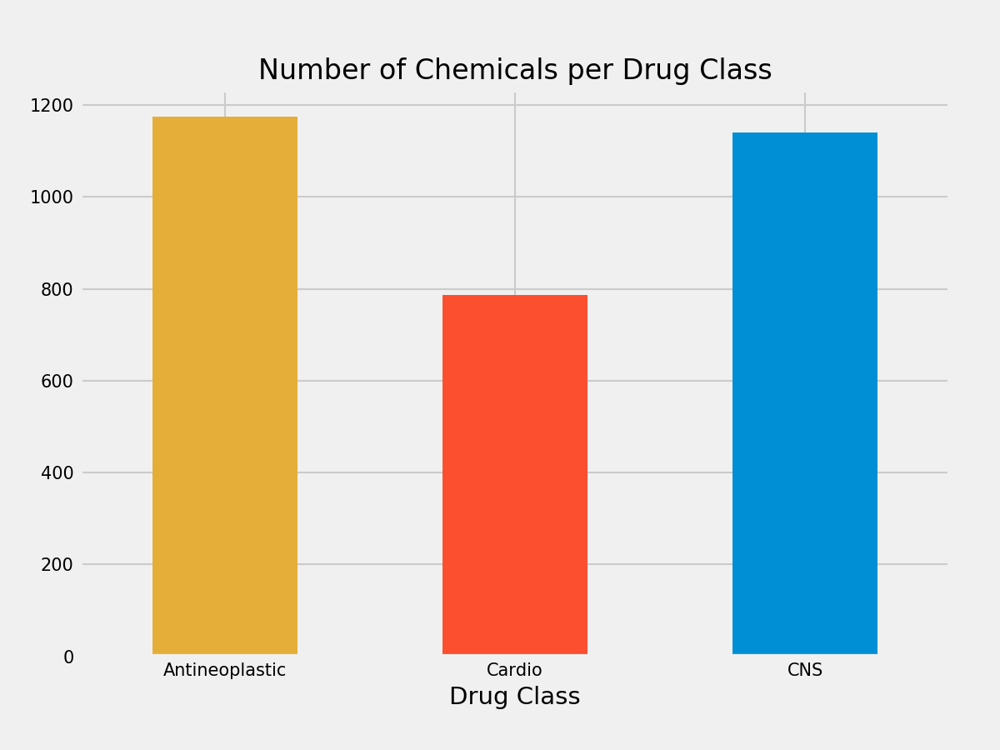

# Molecular Cell Classification
*Acknowledgments: This project is inspired by the work done in the article, [Learning Drug Functions from Chemical Structures with Convolutional Neural Networks and Random Forests](https://pubs.acs.org/doi/10.1021/acs.jcim.9b00236) by Jesse G Meyer, Shengchao Liu, Ian J Miller, Joshua J Coon, Anthony Gitter Journal of Chemical Information and Modeling. 2019, 59(10) 4438-4449. Their github and data sources can be found [here.](https://github.com/jgmeyerucsd/drug-class)*

## Executive Summary
Using images of molecular chemical structures, I built a multi-class classification model to predict the drug treatment class of the chemical.

---

## Problem Statement
Neglected diseases is a term used to describe diseases that affect a niche population with little to no treatments available. The current drug research & development (R&D) system is long and costly, which does not incentivize finding new drug treatments for neglected diseases.

There are examples of drug treatments that were originally developed to treat cancer which were later "shelved," or not used, when proven to be ineffective for treating cancer. Some years later, researchers will come across this drug treatment and discover that it's actually effective in treating another disease, like a neglected disease.

With the onset of image processing techniques, I wanted to explore the possibility of predicting promising new drug treatments based on their molecular structures.

---

## What's my MVP here?

Given the data provided by Meyer, et. al, I want to explore classifying molecules based on:

1. Chemical molecular structure (provided as images). Ex:

2. Chemical properties

I want to compare which model is more accurate at predicting the drug therapy class. If molecular structures perform better, then that implies there is information about the geometric structure of chemicals that is more representative of its properties.

---
## Data

For now, I have copied a subset of the data provided by Meyer, et. al to perform a binary (antineoplastic, or cns) classification model [here](./data/CID_properties_nr.csv).

Here are the available chemicals from the original dataset:

|Drug Class|Number of Chemicals|
|:---|:---|
|antineoplastic|1174|
|cns|1141|
|cardio|787|
|antiinflammatory|372|
|hematologic|268|
|gastrointestinal|255|
|lipidregulating|164|
|reproductivecontrol|148|
|antiinfective|140|
|dermatologic|108|
|respiratorysystem|100|
|urological|22|

In order to have relatively balanced classes, I am focusing the classification model on the three biggest classes: Antineoplastic, CNS, and Cardio.

The images are split into my train set [here](./train_data) and test set [here](./test_data).

---

## EDA

Exploring some of the physical differences among the classes.

#### Molecular Weights

From this distribution, we can see that the molecular weights are distinct for each class. CNS molecules, in general, have a higher molecular weight than the other classes.

#### Hydrogen Bonds
Hydrogen bonds are a special type of attraction where one hydrogen atom bonds to a very electronegative atom in vicinity of another electronegative atom with a lone pair of electrons [(source).](https://chem.libretexts.org/Bookshelves/Physical_and_Theoretical_Chemistry_Textbook_Maps/Supplemental_Modules_\(Physical_and_Theoretical_Chemistry\)/Physical_Properties_of_Matter/Atomic_and_Molecular_Properties/Intermolecular_Forces/Specific_Interactions/Hydrogen_Bonding)

__Hydrogen bond acceptors__ are typically electronegative atoms that have a lone pair of electrons.
[! Hydrogen bond acceptors](./plots/hbond_acceptors.png)

__Hydrogen bond donors__ are hydrogens that are attached to one of those electronegative elements(like Oxygen or Nitrogen). The positive charge that this hydrogen acquires allows it to bond to the nearby electronegative atom.
[! Hydrogen bond donors](./plots/hbond_donors.png)

From these boxplot charts, we see the Antineoplastic drugs have generally more H bond acceptors and H bond donors per molecule. The distribution ranges for each class.

---

## Modeling
